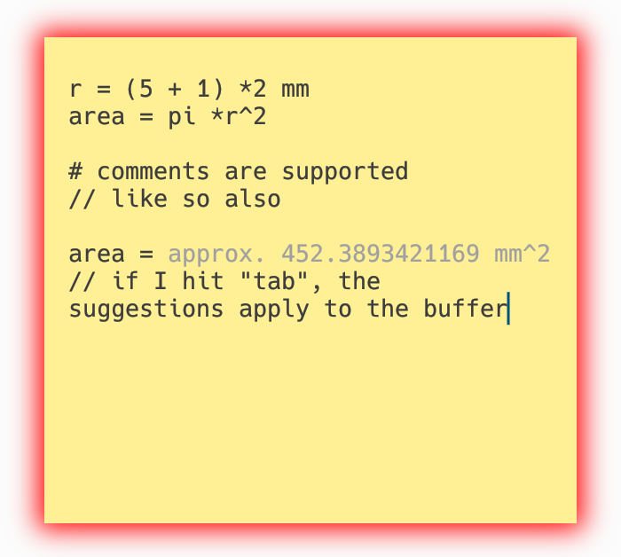

A monorepo for applications powered by the **Crunchie** math engine.

## Crunchie-pad



["Proof of life" application for the core](./crunchie-pad): It's like sticky notes, but with math.
- Just write your math, with or without units, like a normal person
- Hitting `tab` will apply gray "autocalculations"

## Installation

You can install the apps directly from this repository using `cargo`.

### From GitHub
```bash
cargo install --git https://github.com/Taugeshtu/crunchie-apps crunchie-pad
```

### From Local Source
If you have the repository cloned locally:
```bash
cargo install --path crunchie-pad
```
